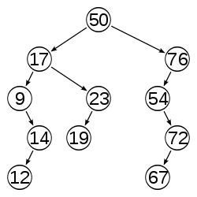
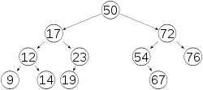
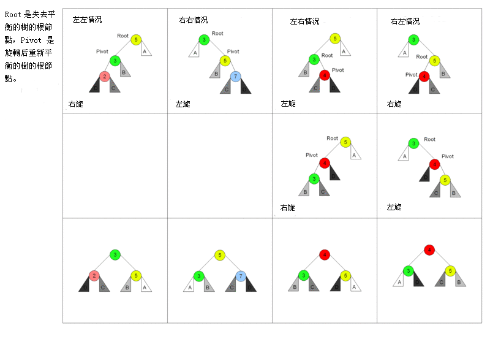
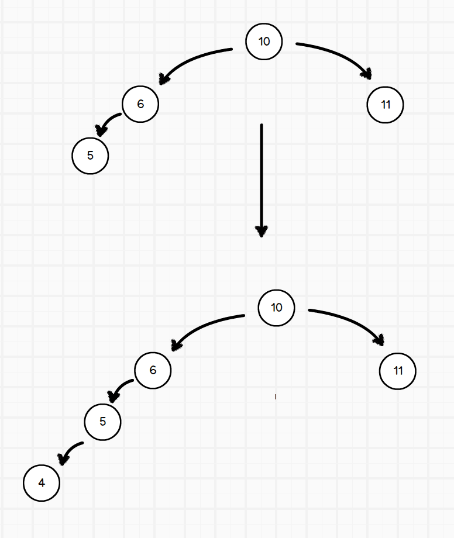
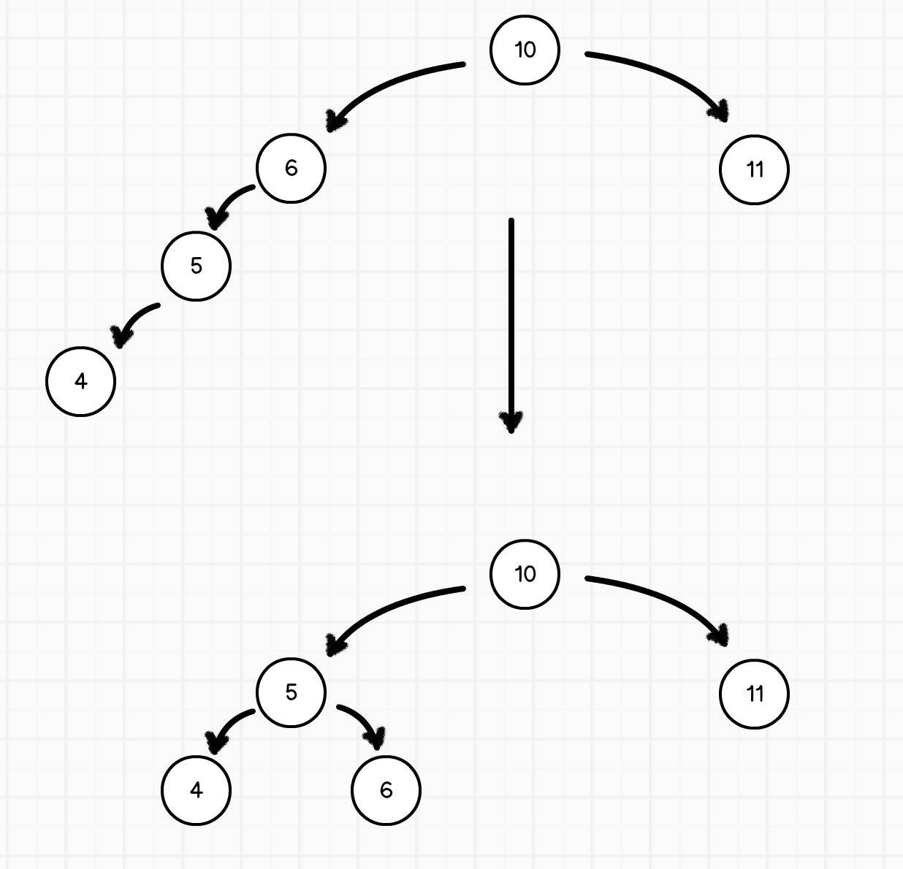
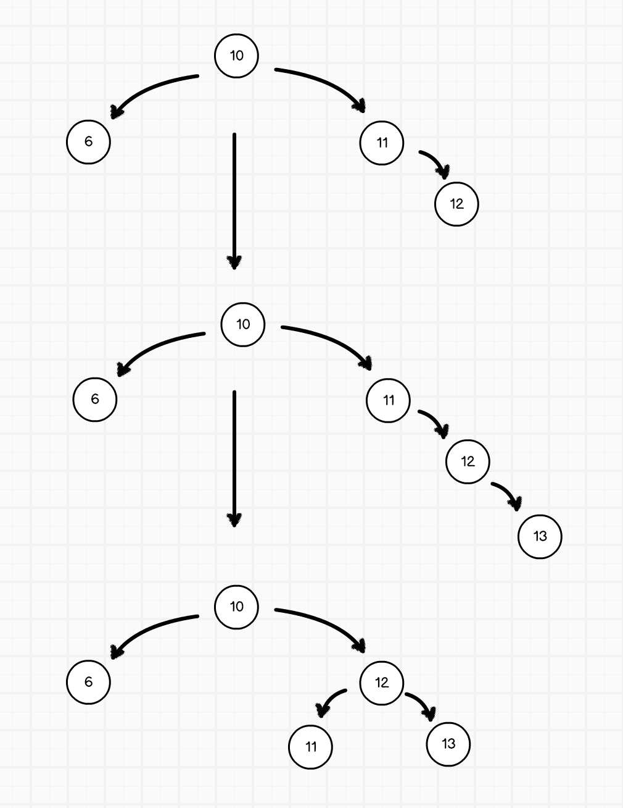
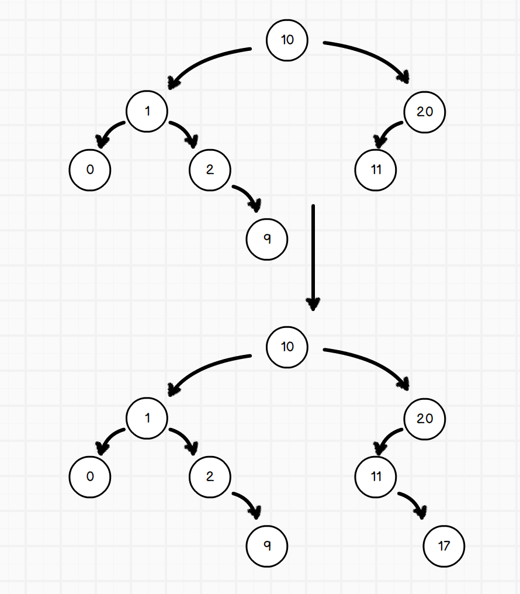
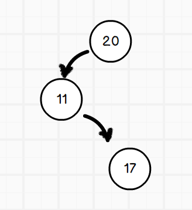
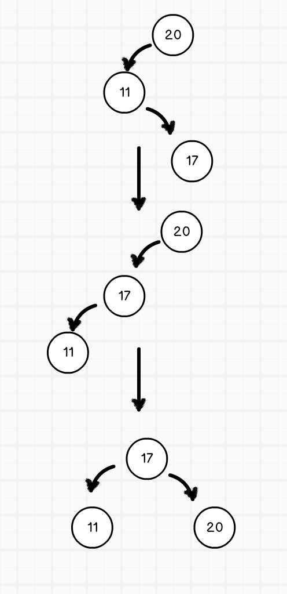

## 平衡二叉搜索树

一般的二叉查找树的查询复杂度是跟目标结点到树根的距离（即深度）有关，因此当结点的深度普遍较大时，查询的均摊复杂度会上升，为了更高效的查询，平衡树应运而生了。

在这里，平衡指所有叶子的深度趋于平衡，更广义的是指在树上所有可能查找的均摊复杂度偏低。

如下图所示，分别为非平衡树和平衡树的样子（图片来源[维基百科平衡树](https://zh.wikipedia.org/wiki/AVL%E6%A0%91)）：





### AVL 树

AVL 树具有以下性质：它是一棵空树，或**它的左右两个子树的高度差的绝对值不超过 1**，并且左右两个子树都是一棵平衡二叉树。利用这种平衡的性质，可以避免二叉搜索树某个子节点过深，或者树删除元素重新排列导致某节点过深的失衡问题。

当插入一个数据，使 AVL 树失去平衡时，无非有四种情况（及其应对方案）：

- 左左失衡（左子树的左子节点）- 通过单向右旋应对
- 右右失衡（右子树的右子节点）- 通过单向左旋应对
- 左右失衡（左子树的右子节点）- 双向旋转，先左后右
- 右左失衡（右子树的左子节点）- 双向旋转，先右后左



我们从头开始分析一下当 AVL 数失衡时的情况。假设有一个二叉搜索树，我们在其初始化之后开始往数上填充内容。

```javascript
/*
 * ATTENTION
 * 在改变节点的父节点、子节点时，是一个双向的过程
 * 已设置 A 节点的左子节点为 B 为例，
 * 既需要把 A 节点的 leftChild 设置为 B，也需要把 B 的 parent 设置为 A
*/
```

#### 左左失衡

在一个空的二叉搜索树上一次填入 `10, 6, 11, 5`，然后在填入 `4` 后，构成如下的树状结构：



很明显，在插入了 4 之后，首先从 6 所在的树已经失去平衡，而造成这种情况的正是失衡点 6 左边子树的左子节点，因此叫做左左失衡。左左失衡的处理方式比较简单，只要对 `6 -> 5 -> 4` 所在的树做一次旋转即可



```javascript
/*
 * 右旋，应对左左失衡
 * 1. 传入失衡的节点 a
 * 2. 获取 a 的左子节点 aChildLeft
 * 3. 把 aChildLeft 提升到 a 的位置
 *    1. a 的父节点成为 aChildLeft 的父节点
 *    2. a 成为 aChildLeft 的右子节点
 * 4. aChildLeft 的原右子节点成为 a 的左子节点
 * 5. aChildRight 的左子节点还是其左子节点
*/
const rightRotate = (node) => {
// 获取 a 的右子节点 aChildLeft
const targetNode = node.leftChild;

  // 如果 a 还有父节点，则把 aChildLeft 作为 a 父节点的左子节点
  // 同时，把 aChildLeft 的父节点设置为了 a 的父节点
  if (node.parentNode) {
    // 为了能够让这个方法更通用，我们假设不知道当前节点是其父节点的左子节点还是右子节点，
    // 因此需要进行判断
    const parentChildPosition = node.isLeftChild
    ? 'leftChild'
    : 'rightChild';
    node.parentNode[parentChildPosition] = targetNode;
    targetNode.parentNode = node.parentNode;
  }
  // 之后，aChildRight 的原右子节点成为 a 的左子节点
  node.leftChild = targetNode.rightChild;
  targetNode.rightChild.parentNode = node;

  targetNode.rightChild = node;
  node.parentNode = targetNode;
};
```

#### 右右失衡

类似于左左失衡。在一个空的二叉搜索树上一次填入 `10, 6, 11, 12`，然后在填入 `13` 后，构成如下的树状结构，然后通过对 `11 -> 12 -> 13` 树进行左旋转调节：



```javascript
/*
 * 左旋，应对右右失衡
 * 1. 传入失衡的节点 a
 * 2. 获取 a 的右子节点 aChildRight
 * 3. 把 aChildRight 提升到 a 的位置
 *    1. a 的父节点成为 aChildRight 的父节点
 *    2. a 成为 aChildRight 的左子节点
 * 4. aChildRight 的原左子节点成为 a 的右子节点
 *    1. a 的右子节点为 aChildRight 的原左子节点
 *    2. aChildRight 的原左子节点的父节点改为 a
 * 5. aChildRight 的右子节点还是其右子节点
*/
const leftRotate = (node) => {
  // 获取 a 的右子节点 aChildRight
  const targetNode = node.rightChild;

  // 如果 a 还有父节点，则把 aChildRight 作为 a 父节点的右子节点
  // 同时，把 aChildRight 的父节点设置为了 a 的父节点
  if (node.parentNode) {
    // 为了能够让这个方法更通用，我们假设不知道当前节点是其父节点的左子节点还是右子节点，
    // 因此需要进行判断
    const parentChildPosition = node.isLeftChild
      ? 'leftChild'
      : 'rightChild';
    node.parentNode[parentChildPosition] = targetNode;
    targetNode.parentNode = node.parentNode;
  }
  // 之后，aChildRight 的原左子节点成为 a 的右子节点
  node.rightChild = targetNode.leftChild;
  targetNode.leftChild.parentNode = node;

  targetNode.leftChild = node;
  node.parentNode = targetNode;
};
```

#### 左右失衡

失衡点左子树的右子节点造成了失衡。如下如，我们先往空树中插入 `10, 1, 20, 11, 0, 2, 9`，然后再插入 `17`



妥妥的，20 所在节点失衡，造成失衡的是它左子节点的右子节点，因此是左右失衡。

我们单独把失衡的节点和它所有的子节点拎出来看，即 `20, 11, 17` 所在节点。



显然，这是个失衡的树。我们先将 `11, 17` 进行一次左旋转，然后再进行一次右旋转，即可让树恢复平衡：



将恢复平衡的树重新放入原有的树中，用新的节点 17 代替旧节点 20，就可得到下面的平衡二叉树：


```javascript
/*
 * 先左旋再右旋，应对左右失衡
 * 输入失衡的节点
*/
const lrRotate = (node) => {
  leftRotate(node.leftChild);
  rightRotate(node);
};
```

#### 右左失衡

右左失衡的情况和左右失衡类似，不再赘述。

```javascript
/*
 * 先右旋再左旋，应对右左失衡
*/
const rlRotate = (node) => {
  rightRotate(node.rightChild);
  leftRotate(node);
};
```

### 红黑树

红黑树是规定了如下特性的二叉搜索树：

- 每个节点或者是黑色，或者是红色
- 根节点是黑色
- 每个叶子节点（NIL）是黑色【注意：这里叶子节点，是指为空(NIL或NULL)的叶子节点！】
- 如果一个节点是红色的，则它的子节点必须是黑色的
- 从一个节点到该节点的子孙节点的所有路径上包含相同数目的黑节点。

在对红黑树进行插入删除的时候进行必要的操作维护红黑树的性质，保持树高平衡性。

### B 树