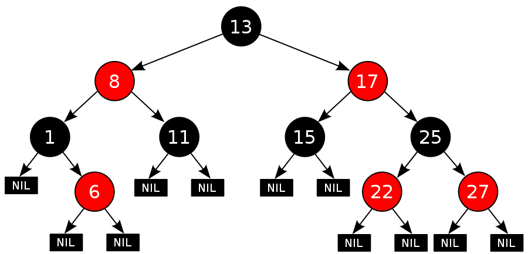
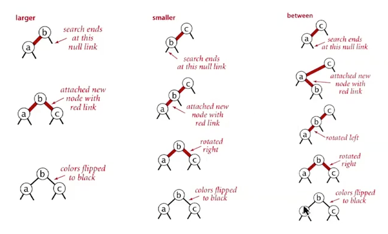
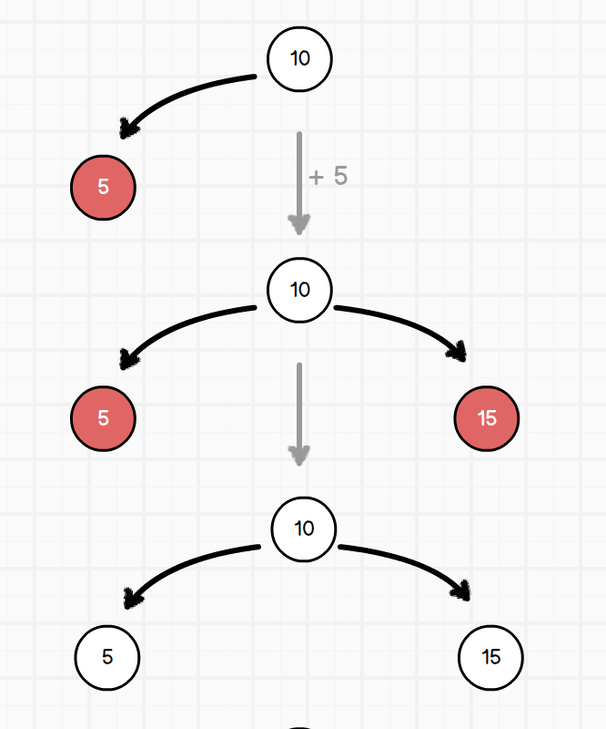
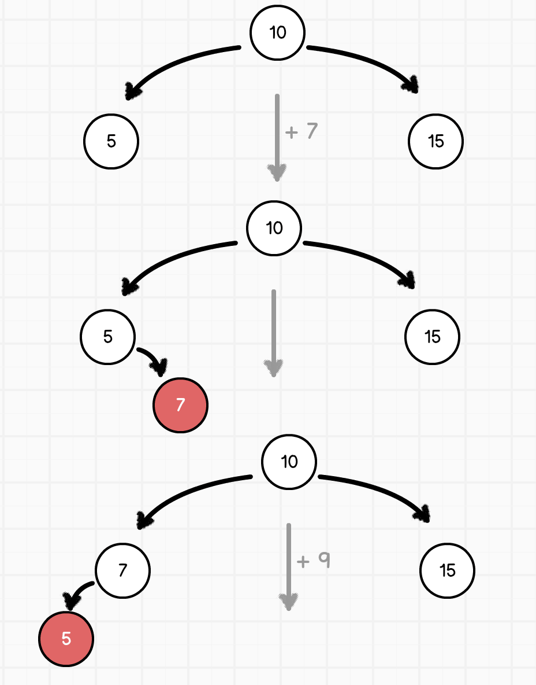
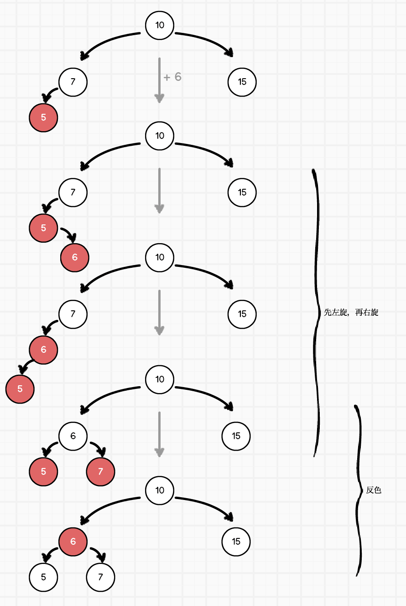

<!-- START doctoc generated TOC please keep comment here to allow auto update -->
<!-- DON'T EDIT THIS SECTION, INSTEAD RE-RUN doctoc TO UPDATE -->
**Table of Contents**  *generated with [DocToc](https://github.com/thlorenz/doctoc)*

- [红黑二叉搜索树](#%E7%BA%A2%E9%BB%91%E4%BA%8C%E5%8F%89%E6%90%9C%E7%B4%A2%E6%A0%91)
  - [数据插入](#%E6%95%B0%E6%8D%AE%E6%8F%92%E5%85%A5)
    - [红色节点插入到了右子节点](#%E7%BA%A2%E8%89%B2%E8%8A%82%E7%82%B9%E6%8F%92%E5%85%A5%E5%88%B0%E4%BA%86%E5%8F%B3%E5%AD%90%E8%8A%82%E7%82%B9)
    - [有连续两个互链接的红色子节点](#%E6%9C%89%E8%BF%9E%E7%BB%AD%E4%B8%A4%E4%B8%AA%E4%BA%92%E9%93%BE%E6%8E%A5%E7%9A%84%E7%BA%A2%E8%89%B2%E5%AD%90%E8%8A%82%E7%82%B9)
    - [左右两个子节点都是红色子节点](#%E5%B7%A6%E5%8F%B3%E4%B8%A4%E4%B8%AA%E5%AD%90%E8%8A%82%E7%82%B9%E9%83%BD%E6%98%AF%E7%BA%A2%E8%89%B2%E5%AD%90%E8%8A%82%E7%82%B9)
  - [数据删除](#%E6%95%B0%E6%8D%AE%E5%88%A0%E9%99%A4)

<!-- END doctoc generated TOC please keep comment here to allow auto update -->

## 红黑二叉搜索树

红黑树是规定了如下特性的二叉搜索树：

- 每个节点或者是黑色，或者是红色
- 根节点是黑色
- 每个叶子节点（NIL）是黑色【注意：这里叶子节点，是**指为空（NIL 或 NULL）的叶子节点**！】
- 如果一个节点是红色的，则它的子节点必须是黑色的
- **每个红色节点必须有两个黑色的子节点。**（从每个叶子到根的所有路径上不能有两个连续的红色节点）
- 从一个节点到该节点的子孙节点的所有路径上包含相同数目的黑节点。
- 红色节点必须在左侧。如果不在，则通过旋转进行调整
- 新插入的节点为红色，然后再进行调整使树重新恢复平衡

在对红黑树进行插入删除的时候进行必要的操作维护红黑树的性质，保持树高平衡性。下图示例源自[维基百科-红黑树](https://zh.wikipedia.org/wiki/%E7%BA%A2%E9%BB%91%E6%A0%91)：



### 数据插入

当插入一个数据时，寻找到树的最底部，然后插入一个红色节点。之后，根据红黑树的定义来让其恢复平衡。而其恢复平衡的方式和 AVL 树稍有不同的是，在左、右旋转完成之后，会把对应节点的颜色交换；除此以外，还多了一个反转节点颜色的方法。

#### 红色节点插入到了右子节点

在最简单的情况下，一个新插入的节点作为红色节点插入到了右侧。此时需要把它和它的父元素进行左旋，使红色节点转换到左侧。


#### 有连续两个互链接的红色子节点

当有两个相互链接的红色节点时，

- 如果是左左红，则右旋再反色
- 如果是右右红，则左旋再反色
- 如果是左右红，则左右旋再反色
- 如果是右左红，则右左旋再反色



#### 左右两个子节点都是红色子节点

反色处理，把两个红色的子节点转为黑色。若父节点不是根节点，则同时把它们的父节点转为红色。

```javascript
// 这些是进行平衡操作是所需的辅助方法
// 大体上和 AVL 二叉树的方法一直，但是需要交互节点的颜色

/*
 * 把 nodeA 的父节点设置为 nodeB 的父节点
 * 1. 确定 nodeA 是其父节点的左子节点还是右子节点
 * 2. 把 nodeA 父节点对应位置的子节点设置为 nodeB
*/
const resetParent = (nodeA, nodeB) => {
  if (nodeA.parentNode) {
    // 我们不知道当前节点是其父节点的左子节点还是右子节点，
    // 因此需要进行判断
    const parentChildPosition = nodeA.isLeftChild
      ? 'leftChild'
      : 'rightChild';
      nodeA.parentNode[parentChildPosition] = nodeB;
      nodeB.parentNode = nodeA.parentNode;
  }
};

// 两个节点相互交换颜色
const resetColor = (nodeA, nodeB) => {
  const targetColor = nodeA.color;
  nodeA.color = nodeB.color;
  nodeB.color = targetColor;
};

const rotateLeft = (node) => {
  // 获取 a 的右子节点 aChildRight
  const targetNode = node.rightChild;

  // 如果 a 还有父节点，则把 aChildRight 作为 a 父节点的右子节点
  // 同时，把 aChildRight 的父节点设置为了 a 的父节点
  resetParent(node, targetNode);
  // 之后，aChildRight 的原左子节点成为 a 的右子节点
  node.rightChild = targetNode.leftChild;
  if (targetNode.leftChild) {
    targetNode.leftChild.parentNode = node;
  }

  targetNode.leftChild = node;
  node.parentNode = targetNode;

  resetColor(targetNode, node);
  return targetNode;
};

const rotateRight = (node) => {
  // 获取 a 的右子节点 aChildLeft
  const targetNode = node.leftChild;

  // 如果 a 还有父节点，则把 aChildLeft 作为 a 父节点的左子节点
  // 同时，把 aChildLeft 的父节点设置为了 a 的父节点
  resetParent(node, targetNode);
  // 之后，aChildRight 的原右子节点成为 a 的左子节点
  node.leftChild = targetNode.rightChild;
  if (targetNode.rightChild) {
    targetNode.rightChild.parentNode = node;
  }

  targetNode.rightChild = node;
  node.parentNode = targetNode;

  resetColor(targetNode, node);
  return targetNode;
};

/*
 * 当一个节点的左右两个子节点都是红节点时，
 * 则将这两个红子节点转换为黑色，同时把它们的父节点转换为红色
*/
const flipColor = (node) => {
  const leftChild = node.leftChild;
  const rightChild = node.rightChild;

  leftChild.color = 'black';
  rightChild.color = 'black';

  if (node.parentNode) {
    node.color = 'red';
  }
};
```

---

一个更加完整的插入流程如下所示：

1. 首先从根节点开始，先插入 `10`，然后插入 `5 15`，则出现两个红色子节点，需要反色：



2. 然后继续插入 `7`，7 成为红色右子节点，所以需要左旋处理：



3. 接着插入 `6`，6 成为 5 的红色右子节点，需要左旋处理。处理完成之后出现了两个连续的左左红节点，因而需要右旋处理；紧接着成为左右两个红色节点，需要反色处理：



```javascript
// 具体的插入操作如下
class Node {
  // 判断当前节点属于父节点的左子节点还是右子节点
  get isLeftChild() {
    return this.parentNode.leftChild === this;
  }

  get isRightChild() {
    return this.parentNode.rightChild === this;
  }

  get hasRedLeftChild() {
    return this.leftChild && this.leftChild.color === 'red';
  }

  get hasRedRightChild() {
    return this.rightChild && this.rightChild.color === 'red';
  }

  insert(val) {
    if (this.node < val) {
      if (this.rightChild === null) {
        this.rightChild = new Node({
          val,
          color: 'red',
          parentNode: this,
        });
      } else {
        this.rightChild.insert(val);
      }
    } else if (this.node > val) {
      if (this.leftChild === null) {
        this.leftChild = new Node({
          val,
          color: 'red',
          parentNode: this,
        });
      } else {
        this.leftChild.insert(val);
      }
    }

    // 插入完成之后从底部开始检查平衡
    this.checkBalance();
  }

  checkBalance() {
    let targetNode = this;
    // 先检查有没有需要反色
    targetNode.flipColor();
    // 检查是否需要左旋
    if (targetNode.hasRedRightChild) {
      targetNode = rotateLeft(targetNode);
    }
    // 因为左旋之后可能会出现左左的情况，检查是否需要右旋
    if (targetNode.hasRedLeftChild && targetNode.color === 'red') {
      targetNode = rotateRight(targetNode.parentNode);
    }
    targetNode.flipColor();
  }

  flipColor() {
    if (this.hasRedLeftChild && this.hasRedRightChild) {
      flipColor(this);
    }
  }
}
```

### 数据删除

- [算法导论中，红黑树删除操作中图 13.7 如何理解？](https://www.zhihu.com/question/31034037)